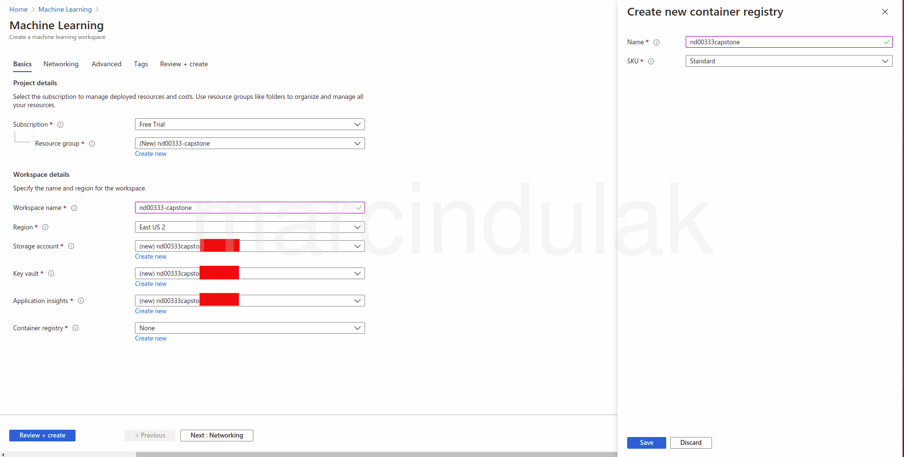
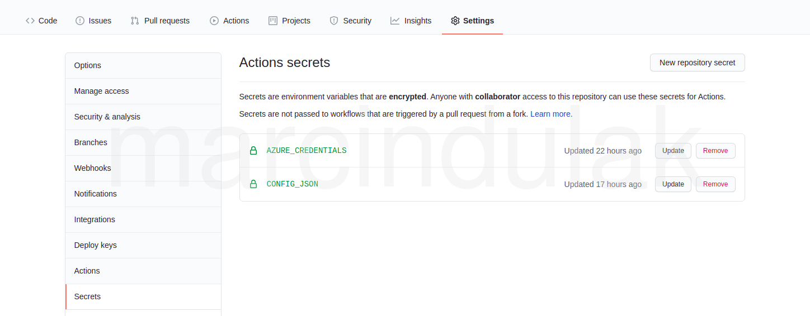

# Anomaly-based intrusion detection in computer networks

The goal of this project is to create a classification model for telling apart
a benign and various malicious types of traffic in computer networks.
This project uses an anomaly-based approach
[https://en.wikipedia.org/wiki/Intrusion_detection_system](https://en.wikipedia.org/wiki/Intrusion_detection_system),
by fitting a model to the labeled network flows using supervised machine learning techniques.

In the anomaly-based approach, it is assumed that certain network traffic characteristics like the number of packets
per second in the flow, flow duration or presence or absence of certain protocol flags, can be used to tell apart
a benign from a malicious traffic.
An alternative, signature-based method of intrusion detection which inspects the packet payloads looking for
established malicious patterns, represents a complementary approach.

In agreement with existing projects [https://github.com/cstub/ml-ids](https://github.com/cstub/ml-ids) and literature
this project illustrates that "most machine learning algorithms assume that the data follow the same distribution,
which is not practical in networking environments"
[https://doi.org/10.1109/MNET.2017.1700200](https://doi.org/10.1109/MNET.2017.1700200).
It is found that the model is not transferable. The model performs reasonably well on the test dataset generated using
the specific network architecture and usage patterns, by yielding the
[macro average recall](https://scikit-learn.org/stable/modules/generated/sklearn.metrics.recall_score.html)
of over 0.8 and macro average precision of over 0.9. However, the model fails completely (macro average recall of 0.2) on a
test dataset generated in a different network environment.

The total cost of this project was about $10 USD.

# Table of contents

- [Anomaly-based intrusion detection in computer networks](#anomaly-based-intrusion-detection-in-computer-networks)
- [Table of contents](#table-of-contents)
- [Project Set Up and Installation](#project-set-up-and-installation)
  - [Local development environment setup](#local-development-environment-setup)
- [Dataset](#dataset)
  - [Overview](#overview)
  - [Task](#task)
  - [Access](#access)
- [Models](#models)
  - [Automated ML](#automated-ml)
    - [Results](#results)
  - [Hyperparameter Tuning](#hyperparameter-tuning)
    - [Results](#results-1)
- [Model Testing](#model-testing)
- [Model Deployment](#model-deployment)

# Project Set Up and Installation

## Local development environment setup

The instructions below are specific to Ubuntu Linux:

1. If you don't have an Azure subscription, register for an [Azure free account](https://azure.microsoft.com/en-us/free/).
   This requires a phone number and a credit card for verification, and provides $200 USD credit during one month.
   After that the account can be converted into a paid account,
   but Azure won't charge any costs without explicit conversion by the user.

2. Login to portal.azure.com and "Create machine learning workspace"

   

3. Launch "Machine Learning Studio" and fetch the `config.json`.
   Paste the json as the `CONFIG_JSON` github secret.

   

4. Install [azure-cli](https://docs.microsoft.com/en-us/cli/azure/install-azure-cli)
   ```sh
   curl -sL https://aka.ms/InstallAzureCLIDeb | sudo bash
   ```
   **Note**: consider instead downloading the specific deb package and installing it manually,
   avoiding "curl to bash".

5. Install [azure-cli-ml](https://docs.microsoft.com/en-us/azure/machine-learning/reference-azure-machine-learning-cli) extension
   ```sh
   az login  # installation of the extension wants a login
   az extension add --name azure-cli-ml --version 1.21.0 --debug
   ```

6. Create Azure [service principal](https://docs.microsoft.com/en-us/azure/active-directory/develop/app-objects-and-service-principals)
   for the purpose of programatically performing tasks in Azure:
   ```sh
   az ad sp create-for-rbac --name <your-sp-name> --role contributor \
   --scopes /subscriptions/<your-subscriptionId>/resourceGroups/<your-rg> --sdk-auth
   ```
   The `<your-sp-name>` could be for example the repository name `nd00333-capstone`.
   The json output will resemble:
   ```
   {
     "clientId": "...",
     "clientSecret": "...",
     "subscriptionId": "...",
     "tenantId": "...",
     ...
   }
   ```
   Paste the json output as the `AZURE_CREDENTIALS` github secret.

7. Install [docker](https://docs.docker.com/get-docker/)

8. Install miniconda:
   ```sh
    curl -sLO https://repo.anaconda.com/miniconda/Miniconda3-py38_4.9.2-Linux-x86_64.sh
    sh Miniconda3-*-Linux-x86_64.sh -b -p $HOME/miniconda3
    # Do this to avoid overwriting your default system python
    echo '[ -f "$HOME/miniconda3/etc/profile.d/conda.sh" ] && source "$HOME/miniconda3/etc/profile.d/conda.sh"' >> ~/.bashrc
    . ~/.bashrc
    conda config --add channels conda-forge
    conda config --set channel_priority strict
    conda config --set env_prompt '({name}) '
    conda env create -p $PWD/venv -f environment.yml
    conda activate $PWD/venv
    python -c "import nd00333"
    conda deactivate
    ```
9. Test the setup by running the package tests
   ```sh
   conda activate $PWD/venv
   python -m pytest -v
   ```

10. Build the docker image of the jupyter server, start the container and test it on `localhost:888`:
    ```sh
    cd .devcontainer
    docker-compose -f docker-compose.yml build
    devcontainer_app:latest nd00333capstonedevcontainer_app:latest
    cd ..
    docker run -d -p 8888:8888 -v $(pwd):/app --name nd00333capstonedevcontainer_app_1 \
    nd00333capstonedevcontainer_app:latest \
    jupyter notebook --allow-root --ip=0.0.0.0 --port=8888
    ```
    The full url is shown in the container logs `docker logs nd00333capstonedevcontainer_app_1`.

11. If preferred, install [vscode](https://code.visualstudio.com/download) for developing ipynb jupyter notebooks inside of
    [remote containers](https://code.visualstudio.com/docs/remote/containers)

# Dataset

## Overview

The dataset used for training comes from Canadian Institute for Cybersecurity.
The information about the dataset is available at [https://www.unb.ca/cic/datasets/ids-2018.html](https://www.unb.ca/cic/datasets/ids-2018.html) and
the data is hosted in AWS S3 [https://registry.opendata.aws/cse-cic-ids2018/](https://registry.opendata.aws/cse-cic-ids2018/).

The out-of-sample test set is available at [https://www.unb.ca/cic/datasets/ids-2017.html](https://www.unb.ca/cic/datasets/ids-2017.html).
Both datasets were created using [CICFlowMeter](https://github.com/CanadianInstituteForCybersecurity/CICFlowMeter)
network traffic flow generator and analyser.
The 2017 and 2018 datasets differ in terms of network topology and usage patterns.

## Task

The 2018 dataset consists of labeled network flows categorized into a "Benign" and various malicious categories.
The dataset is distributed as 10 csv files corresponding to every day capture.
The dataset contains 80 features and has the size of 6.5 GB.

During the data preprocessing step [1-data-preprocessing.ipynb](1-data-preprocessing.ipynb) the
low variance and duplicate features are removed upfront. Moreover the largest data file contains
`extra_features` not present in other data files, and they are therefore also removed.
Additionally, due to a large number (almost 8 millions) samples if the largest data set a sample
of 5% (instead of 50% as in all other data files) is used in the process of feature selection.

The features are selected in `get_feature_list` using an addition process, where features are
added on-by-one in the order of importance, only if by adding a feature the performance metrics
(the macro average of recall across all target classes) increases by a threshold.

[Hamed, T.: page 104](http://hdl.handle.net/10214/10315) suggested a
custom performance metrics based on accuracy, detection rate and false alarm rate. The present project focused on
recall and since the out-of-sample performance was not satisfactory other types of performance metrics were not
explored as they would most likely not improve the recall.

Many people claim that no feature selection should be performed.
[Frank Harrell](https://twitter.com/f2harrell/status/1137012097391312897?lang=en) says
`Feature selection doesn't work in general because it can't find the right variables and
distorts statistical properties`.
In this project reducing the number of features is performed in order to keep the model size and
prediction times reasonable.

In principle a feature selection should happen on an isolated subset of the data,
in order to not involve the test data in any model choices.
This approach is not followed strictly here, as the feature selection is performed based on
the full dataset. This is however acceptable, since another, separate out-of-sample test set
from 2017 is used for the final estimation of the model performance.

After the data prepossessing is performed the dataset consist of 19 features and has 13 malicious
traffic categories and one benign category.
It contains about 8 millions network flows and occupies about 600 MB disk space.

## Access

The datasets are uploaded to the default workspace datastore using az-cli.
The [nd00333/dataset/register/register.py](nd00333/dataset/register/register.py) script is then
used for registering the datasets in the workspace using the files uploaded into the datastore.

The [scripts/datasets-register.sh](scripts/datasets-register.sh) can be used to carry out the
upload and registration process.

# Models

Two approaches for fitting the models are used in this project.

The AutoML is based on [ensemble learning](https://en.wikipedia.org/wiki/Ensemble_learning) methods implemented in sklearn,
where various constituent models are first fitted and then combined using for example
a [VotingClassifier](https://scikit-learn.org/stable/modules/generated/sklearn.ensemble.VotingClassifier.html),
aiming at a better performance than that of the individual models.
AutoML has unfortunately several drawbacks:

- there is currently (beginning of 2021, azureml-sdk 1.21.0) no official API to provide custom, versioned dependencies for
  the AutoML training environment used on the remote compute cluster
  [https://github.com/Azure/MachineLearningNotebooks/issues/1315](https://github.com/Azure/MachineLearningNotebooks/issues/1315).
  This results in errors and tends to make the old models trained with AutoML unusable when
  Azure updates the default version of azureml-sdk used by compute instances for AutoML,

- there is currently (beginning of 2021, azureml-sdk 1.21.0) no official API to
  provide AutoML with a [Random seed](https://en.wikipedia.org/wiki/Random_seed),

- the AutoMLConfig lacks the user control over the hyperparameters of the constituent models.
  This is problematic for several types of models, like random forest, which may grow considerably in size on disk if unbounded.

The HyperDrive is performing various types of [hyperparameter optimization](https://en.wikipedia.org/wiki/Hyperparameter_optimization).
While it does not offer all hyperparameters tuning methods like gradient, or genetic optimization, user has a full control
over the hyperparameters and performance metrics by providing a custom training script.

## Automated ML

The AutoML was performed using the [3-automl.ipynb](3-automl.ipynb) jupyter notebook.

It should be noted that several settings that may affect the model performance are used in
AutoMLConfig in order to speed up the training:

- the number of iterations (individual model runs) is limited to 15,
- instead of a cross-validation method, a single split into the training and validation data is
  specified using `validation_size`=0.3 in order to reduce the training time,
- the `enable_stack_ensemble` ensemble model is excluded due to a slow fitting of the final model,
- only the `LightGBM`, `LogisticRegression`, `SGD`, `XGBoostClassifier` models are allowed in
  the runs in `allowed_models`. Models from the `RandomForest` family unbounded by `max_depth`
  may grow very large for this particular data set (to e.g. several hundreds Mbytes).

The individual model runs are performed in parallel using all cores available on the
compute instance by `max_cores_per_iteration`=-1. The number of `max_concurrent_iterations`
is set to the number of the nodes in the compute cluster.

See [nd00333/model/automl/train/run_config.py](nd00333/model/automl/train/run_config.py) for details.

### Results

The AutoML `VotingClassifier` produced a model with the macro average recall of about 0.83 for
the validation set. On the test set the macro average recall was 0.86 and the macro average
precision 0.91, respectively. Taking into account both the precision and recall the AutoML
model achieved lower performance than the model produced by the hyperparameter training.

Including the `RandomForest` family of models would result in a better performing
model however this would make the model size very large since every tree based model may
attain several hundreds of Megabytes of size. Performing a cross-validation instead
of a single train/validate split would result in a better model generalization,
however that would most likely not improve the model performance on the out-of-sample dataset.

## Hyperparameter Tuning

The AutoML was performed using the [2-hyperparameter_tuning.ipynb](2-hyperparameter_tuning.ipynb) jupyter notebook.

The hyperparameter tuning is performed using a grid search using the sklearn `RandomForestClassifier`.
The random forest family of models offers conceptually simple models, which tend to generalize
well, and don't require feature scaling.

The following hyperparameters are varied:

- the number of trees in the forest `n_estimators` (set to 10 in older versions of sklearn and
  to 100 in newer versions) which affects the model generalization.
  More trees will result in longer individual model training time.
- the `criterion` affects the sensitivity of the model to the minority classes,
  which is important for imbalanced datasets, like the one used here,
- the `max_depth` may result in overfitting if set too high, moreover it may considerably
  increase the size of the model (to e.g. several hundreds Mbytes).

The `BanditPolicy` termination policy is set equivalent to
[NoTerminationPolicy](https://docs.microsoft.com/en-us/python/api/azureml-train-core/azureml.train.hyperdrive.noterminationpolicy?view=azure-ml-py)
such that it allows the grid search to explore all hyperparameter values.
The individual model runs are performed in parallel using all cores available on the compute
instance by setting `n_jobs`=-1. The number of `max_concurrent_runs` is set to the number of
the nodes in the compute cluster.

See [nd00333/model/hyperdrive/train/run_config.py](nd00333/model/hyperdrive/train/run_config.py) for details.

### Results

The best model yields the macro average recall of about 0.86 for
the validation set. On the test set the macro average recall was 0.86 and the macro average
precision 0.93, respectively. Taking into account both the precision and recall the
model resulted from hyperparameter tuning achieved higher performance than the AutoML model.
By relaxing the `max_depth` to over 30 the model is capable of achieving the macro average recall of over 0.87.
Similarly, techniques designed for imbalanced datasets, e.g. SMOTE (for an overview, check out for example
[https://github.com/solegalli/machine-learning-imbalanced-data](https://github.com/solegalli/machine-learning-imbalanced-data))
even further improve the macro average recall, however they do not improve the model performance on the out-of-sample dataset.
An extensive exploration of various imbalanced datasets techniques is computationally prohibitive.

The "best" model performance metrics on the 2018 test set is shown below:

```
                          precision    recall  f1-score   support

                  Benign     0.9864    0.9998    0.9930   2048549
                     Bot     1.0000    0.9999    0.9999     43419
        Brute Force -Web     1.0000    0.9524    0.9756        84
        Brute Force -XSS     1.0000    1.0000    1.0000        41
        DDOS attack-HOIC     1.0000    1.0000    1.0000     48951
  DDoS attacks-LOIC-HTTP     1.0000    1.0000    1.0000     86440
   DoS attacks-GoldenEye     1.0000    0.9995    0.9998      8184
        DoS attacks-Hulk     0.9999    0.9999    0.9999      7658
DoS attacks-SlowHTTPTest     0.7728    0.5163    0.6191     41976
   DoS attacks-Slowloris     0.9992    1.0000    0.9996      2598
          FTP-BruteForce     0.7177    0.8902    0.7947     58010
           Infilteration     0.6913    0.0355    0.0675     29297
           SQL Injection     0.8889    0.6154    0.7273        13
          SSH-Bruteforce     1.0000    0.9998    0.9999     56208

                accuracy                         0.9772   2431428
               macro avg     0.9326    0.8578    0.8697   2431428
            weighted avg     0.9741    0.9772    0.9714   2431428
```

# Model Testing

The best models obtained from both HyperDrive and AutoML runs are tested on
the 2018 test dataset and the full 2017 dataset.
The results are available in the "Model Testing" sections of the notebooks.
It should be noted that the predictions on the test sets are obtained by loading the model and calling the `predict`
method locally on the jupyter notebook instances. While AzureML has an experimental
[ModelProxy](https://docs.microsoft.com/en-us/python/api/azureml-train-automl-client/azureml.train.automl.model_proxy.modelproxy?view=azure-ml-py)
class for obtaining model predictions on the remote compute cluster,
this feature is only supported by AutoML (beginning of 2021, azureml-sdk 1.21.0) and
still requires splitting large input datasets into batches.

# Model Deployment

The best model is retrieved from the run and registered to the AzureML workspace.

The best model is then deployed on a remote Azure container instance, using the `AciWebservice` SDK API.
First an `Environment` is setup, using an explicit docker image tag passed together with the
python dependencies versioned by conda's
[nd00333/model/deploy/environment.yml](nd00333/model/deploy/environment.yml) file into an `InferenceConfig`.

See [nd00333/model/deploy/run_config.py](nd00333/model/deploy/run_config.py) for details.

The model can be queried by different means, all those ways are presented in the notebook.
The prediction can be obtained directly by invoking `service.run(data)`, making an HTTP
POST request to the endpoint using curl or programmatically.
For example curl can be invoked using a script as follows
(the api key and url below are no longer active):

```sh
cat post.sh
SECONDARY_API_KEY="OQoUaPyIpMdAMa6fgecw6F5uLnIDM7e5"
URL="http://3355e6eb-6f5e-4014-85ac-8569bb0f8ca8.eastus2.azurecontainer.io/score"
curl -X POST \
      -H 'Content-Type: application/json' \
      -H "Authorization: Bearer $SECONDARY_API_KEY" \
      --data @data.json $URL
cat data.json | jq
{
  "data": [
    {
      "Flow Duration": 3761843,
      "TotLen Fwd Pkts": 1441,
      "TotLen Bwd Pkts": 1731,
      "Fwd Pkt Len Std": 191,
      "Bwd Pkt Len Max": 1179,
      "Bwd Pkt Len Std": 405,
      "Flow Byts/s": 843,
      "Flow Pkts/s": 6,
      "Flow IAT Max": 953181,
      "Bwd IAT Min": 124510,
      "Bwd Header Len": 172,
      "Pkt Len Max": 1179,
      "Pkt Len Std": 279,
      "RST Flag Cnt": 1,
      "PSH Flag Cnt": 1,
      "ECE Flag Cnt": 1,
      "Init Fwd Win Byts": 8192,
      "Init Bwd Win Byts": 62644,
      "Fwd Seg Size Min": 20
    }
  ]
}
sh post.sh
"{\"result\": [\"Benign\"]}
```
